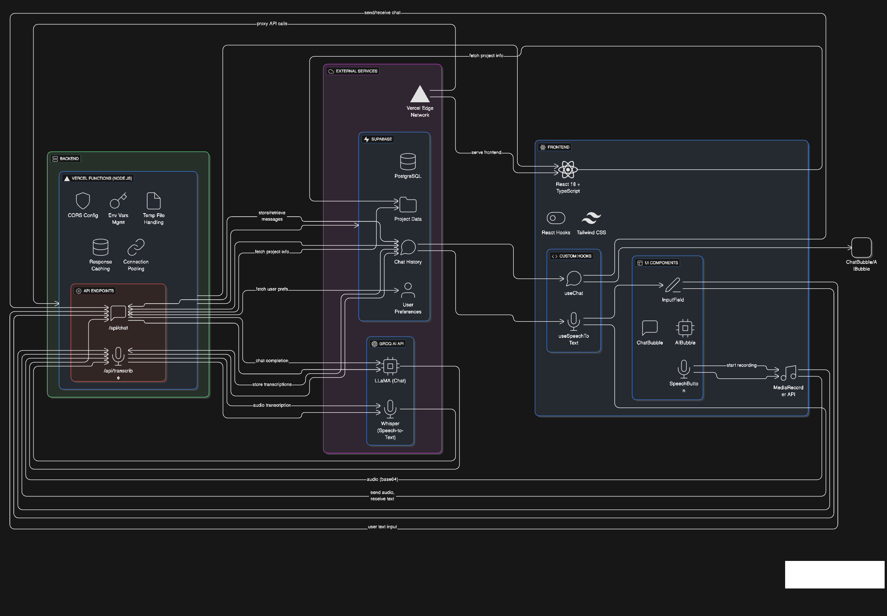
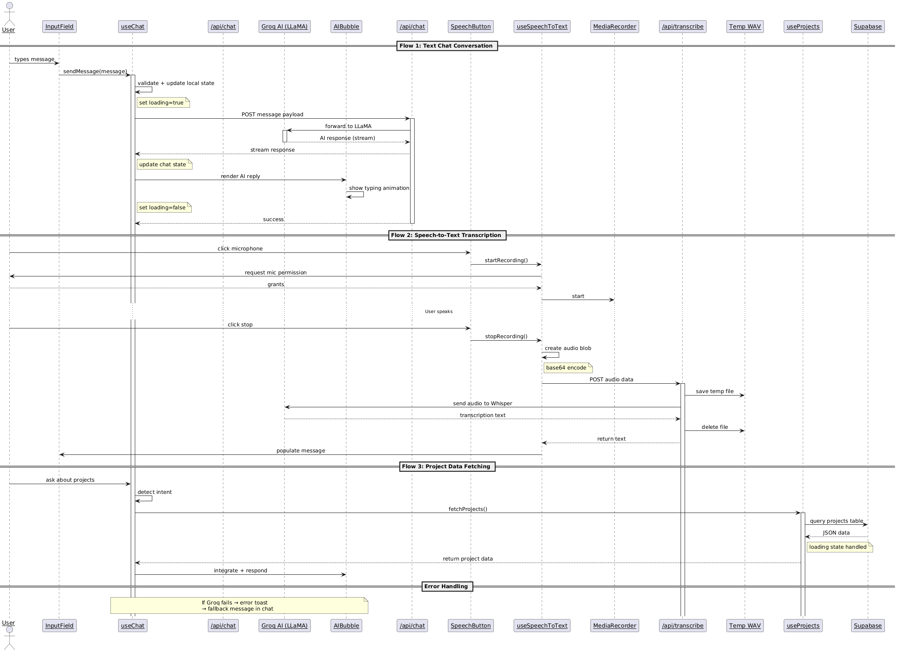

# Architecture Overview

This document outlines the technical architecture and design decisions behind the VCTR AI Chat Assistant.

## System Architecture



## Project Structure

```
chat-bot/
├── README.md
├── package.json
├── tsconfig.json
├── vite.config.ts
├── eslint.config.js
├── vercel.json
├── index.html
├── api/
│   ├── chat.ts
│   └── transcribe.ts
├── public/
│   ├── favicon.png
│   ├── logo.png
│   ├── main-bg.svg
│   ├── bg-top-right.png
│   ├── bg-bottom-left.png
│   ├── mobile-bg.png
│   ├── tablet-bg.png
│   ├── user-buble-bg.png
│   ├── profile.png
│   └── screenshots/
│       ├── default.png
│       ├── general-chat.png
│       ├── projects-chat.png
│       ├── project-modal.png
│       ├── speech-to-text.png
│       ├── faqs-active.png
│       └── delete-modal.png
├── src/
│   ├── main.tsx
│   ├── App.tsx
│   ├── App.css
│   ├── index.css
│   ├── variants.ts
│   ├── vite-env.d.ts
│   ├── assets/
│   │   └── react.svg
│   ├── components/
│   │   ├── AIBubble.tsx
│   │   ├── ChatBubble.tsx
│   │   ├── Content.tsx
│   │   ├── FAQs.tsx
│   │   ├── InputField.tsx
│   │   ├── LoadingBubble.tsx
│   │   ├── NavBar.tsx
│   │   ├── SpeechButton.tsx
│   │   ├── ToggleButton.tsx
│   │   ├── WarningDialog.tsx
│   │   └── projects/
│   │       ├── ProjectDialog.tsx
│   │       └── ProjectPreview.tsx
│   ├── context/
│   │   └── ThemeContext.tsx
│   ├── data/
│   │   └── faqsData.ts
│   ├── hooks/
│   │   ├── useChat.ts
│   │   ├── useSpeechToText.ts
│   │   └── useProjects.ts
│   ├── loaders/
│   │   └── Loaders.tsx
│   ├── types/
│   │   ├── chatLog.ts
│   │   ├── projects.ts
│   │   ├── theme.ts
│   │   └── speechToText.ts
│   └── utils/
│       ├── intentDetection.ts
│       └── textFormatter.ts
└── docs/
    ├── README.md
    ├── ARCHITECTURE.md
    ├── DEVELOPMENT.md
    ├── API_DOCUMENTATION.md
    └── DEPLOYMENT.md
```

### State Management Philosophy

I chose React's built-in state management over external libraries like Redux because:

1. **Application Complexity**: The chat state is primarily local and doesn't require complex global state
2. **Performance**: Hooks provide sufficient optimization with proper memoization
3. **Bundle Size**: Avoiding external dependencies keeps the application lightweight
4. **Development Speed**: React hooks offer faster iteration during development

### Key Design Patterns

#### Custom Hooks for Logic Separation
```typescript
// Example: Speech-to-text hook encapsulates all audio logic
const useSpeechToText = () => {
  // MediaRecorder setup, error handling, transcription logic
  return { isRecording, transcript, startRecording, stopRecording };
};
```

#### Render Props Pattern for Flexibility
```typescript
// Clean separation of UI states
const renderFormContent = () => {
  if (isRecording) return <SpeechButton />;
  if (isTranscribing) return <LoadingSpinner />;
  return <InputField />;
};
```

## Backend Architecture

### Serverless Function Design

I implemented the backend using Vercel serverless functions for several strategic reasons:

**Benefits:**
- **Zero Infrastructure Management**: Focus on business logic rather than server maintenance
- **Automatic Scaling**: Handles traffic spikes without configuration
- **Cost Efficiency**: Pay-per-execution model ideal for chat applications
- **Global Edge Distribution**: Reduced latency for users worldwide

### API Endpoints

#### `/api/chat.ts`
Handles chat message processing and AI response generation.

**Design Decisions:**
- **Streaming Responses**: Implemented for better user experience during long AI responses
- **Error Boundaries**: Comprehensive error handling with user-friendly messages
- **Rate Limiting**: Protection against abuse while maintaining good UX

#### `/api/transcribe.ts`
Manages speech-to-text conversion using Groq's Whisper API.

**Technical Challenges Solved:**
1. **Audio Format Handling**: Initially complex format detection, simplified to WAV-first approach
2. **Temporary File Management**: Secure file creation and cleanup in serverless environment
3. **Binary Data Processing**: Efficient base64 to buffer conversion

## Data Flow

### Chat Message Flow
```
User Input → Input Validation → API Call → Groq Processing → Response Streaming → UI Update
```

### Speech-to-Text Flow
```
Audio Recording → Blob Creation → Base64 Encoding → API Upload → Groq Transcription → Text Population
```

## Technology Choices

### Frontend Stack
- **React 18**: Latest features including concurrent rendering
- **TypeScript**: Type safety and better developer experience
- **Vite**: Fast development server and optimized builds
- **CSS Custom Properties**: Dynamic theming without JavaScript overhead

### Backend Stack
- **Vercel Functions**: Serverless Node.js runtime
- **Groq SDK**: Official SDK for reliable AI service integration
- **Supabase**: PostgreSQL database with real-time capabilities
- **File System API**: Temporary file handling for audio processing

### Development Tools
- **ESLint**: Code quality and consistency
- **Prettier**: Automated code formatting
- **Git Hooks**: Pre-commit quality checks

## Performance Optimizations

### Frontend Optimizations
1. **Code Splitting**: Dynamic imports for non-critical components
2. **Memoization**: Strategic use of React.memo and useMemo
3. **Optimistic UI**: Immediate feedback before server responses


## Security Considerations

### API Security
- **Environment Variables**: Secure API key management
- **Input Validation**: Sanitization of user inputs
- **Rate Limiting**: Protection against abuse
- **CORS Configuration**: Controlled cross-origin access

### Audio Processing Security
- **Temporary File Cleanup**: Automatic removal of uploaded audio files
- **File Size Limits**: Prevention of resource abuse
- **Format Validation**: Verification of audio file types

## Scalability Considerations

The architecture is designed to handle growth:

1. **Stateless Functions**: Easy horizontal scaling
2. **CDN Integration**: Static asset distribution
3. **Database Ready**: Easy addition of persistent storage
4. **Monitoring Integration**: Ready for production observability tools
