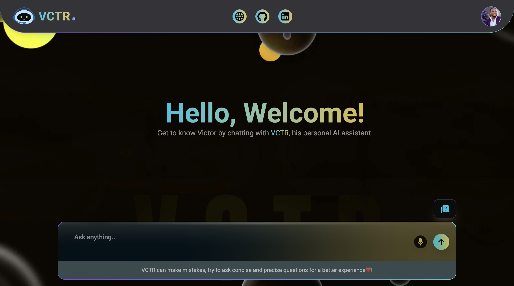
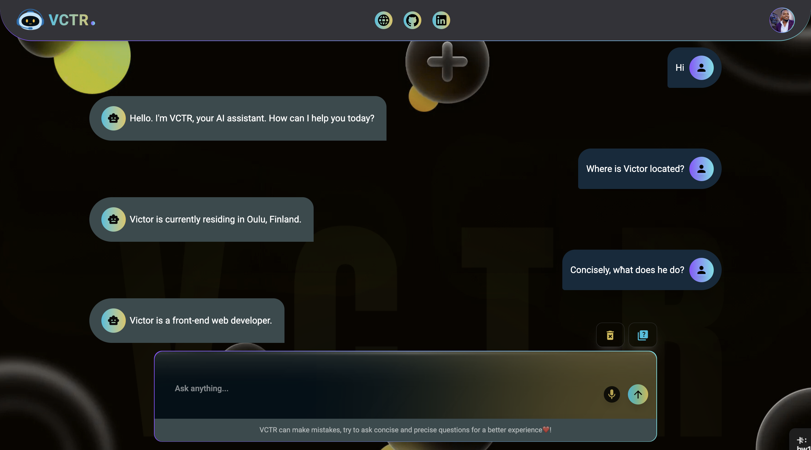
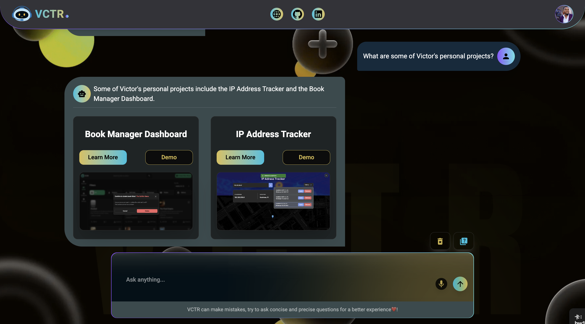
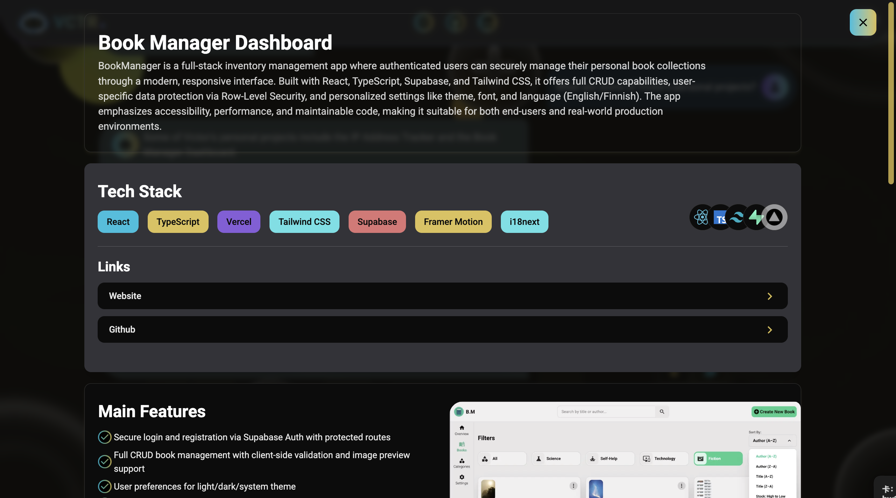

# VCTR AI Chat Assistant

An intelligent chat assistant built with modern web technologies, featuring real-time AI conversations and speech-to-text transcription capabilities.

## Project Overview

I developed this full-stack chat application to demonstrate proficiency in modern web development while exploring the integration of AI services in real-world applications. The project showcases React patterns, serverless architecture, and thoughtful UX design principles.

## Live Demo

**[View Live Application](https://chatbot.victorkevz.com/)**

## Screenshots

### Main Chat Interface

*Clean, modern chat interface with intuitive design*

### AI Conversations

*Intelligent conversations powered by Groq's LLaMA models*

### Project Portfolio Integration

*Dynamic project showcase with real-time data fetching*

*Detailed project information in elegant modal design*

### Speech-to-Text Feature

*Real-time audio transcription with visual feedback*

### Interactive Features

*Interactive FAQ section for quick access to common questions*

*Thoughtful confirmation dialogs for better user experience*

## Key Features

- **Intelligent Conversations**: Powered by Groq's LLaMA models for fast, contextual responses
- **Speech-to-Text**: Real-time audio transcription using Groq's Whisper API
- **Responsive Design**: Optimized for desktop, tablet, and mobile devices
- **Project Showcase**: Dynamic project portfolio integration
- **Real-time Interactions**: Smooth animations and loading states
- **Dynamic Data**: fetches data from supabase 

## Technical Highlights

- **Frontend**: React 18 + TypeScript + Vite for optimal development experience
- **Styling**: Tailwind CSS for responsive design patterns
- **API Integration**: Groq AI services for chat and transcription
- **State Management**: React hooks with optimized re-rendering
- **Audio Processing**: MediaRecorder API with format optimization
- **Deployment**: Vercel serverless functions for scalable backend

## Why I Built This

This project represents my exploration of modern AI integration patterns and demonstrates my ability to:

1. **Architect scalable solutions** using serverless technologies
2. **Integrate complex APIs** while maintaining excellent user experience
3. **Handle real-time data** with proper loading states and error handling
4. **Design intuitive interfaces** that work across all device types
5. **Write maintainable code** with TypeScript and modular architecture

## Development Journey

The project evolved through several iterations, each teaching valuable lessons about full-stack development and AI integration. Key challenges I overcame include optimizing audio processing for web browsers as I had initially used the Web Speech API which I later found to be hard to use. Also, implementing robust error handling for AI services, and creating seamless user interactions.

## Documentation

- [📁 Architecture Overview](./ARCHITECTURE.md)
- [🔧 Development Guide](./DEVELOPMENT.md)
- [🌐 API Documentation](./API_DOCUMENTATION.md)
- [🚀 Deployment Guide](./DEPLOYMENT.md)

## Contact

**Victor Kevz**
- Portfolio: [victorkevz.com](https://victorkevz.com/)
- LinkedIn: [Victor Kuwandira](https://www.linkedin.com/in/victor-kuwandira/)
- Email: contact@victorkevz.com
